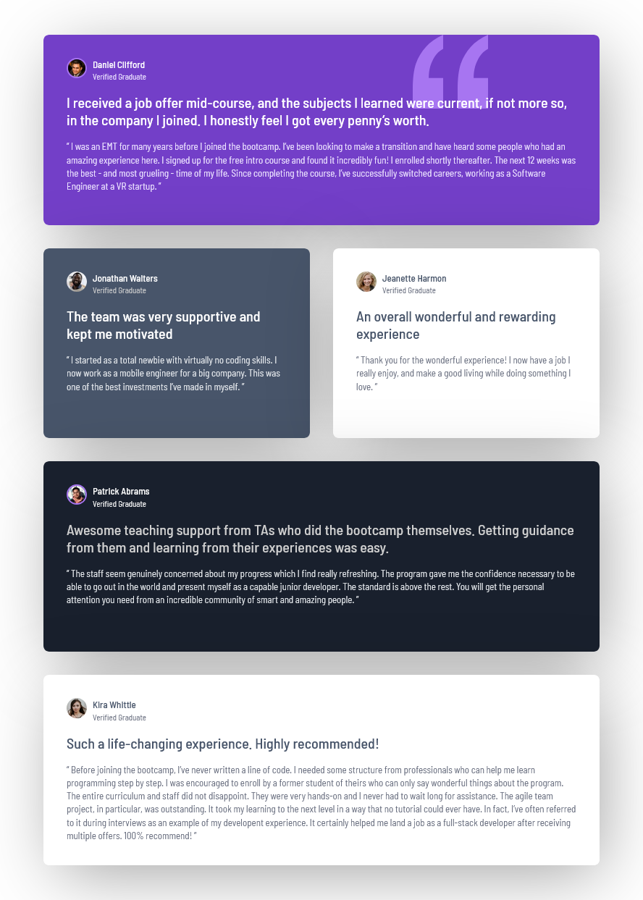
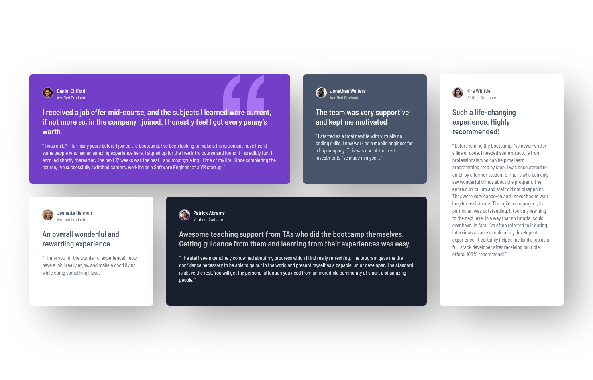

# Frontend Mentor - Testimonials grid section solution

This is a solution to the [Testimonials grid section challenge on Frontend Mentor](https://www.frontendmentor.io/challenges/testimonials-grid-section-Nnw6J7Un7). Frontend Mentor challenges help you improve your coding skills by building realistic projects.

## Table of contents

- [Overview](#overview)
  - [The challenge](#the-challenge)
  - [Screenshot](#screenshot)
  - [Links](#links)
- [My process](#my-process)
  - [Built with](#built-with)
  - [What I learned](#what-i-learned)
  - [Continued development](#continued-development)
  - [Useful resources](#useful-resources)
- [Author](#author)
- [Acknowledgments](#acknowledgments)

## Overview

### The challenge

Users should be able to:

- View the optimal layout for the site depending on their device's screen size

### Screenshot

  <figure>
    <figcaption>Mobile Screen Size</figcaption>
    
  </figure>

  <figure>
    <figcaption>Medium Screen Size</figcaption>
    
  </figure>

  <figure>
    <figcaption>Desktop Screen Size</figcaption>
    
  </figure>

### Links

- Solution URL: [Link](https://www.frontendmentor.io/solutions/testimonial-grid-section-with-responsive-design-v4BWjJBsS6)
- Live Site URL: [Link](https://pete13232.github.io/testimonials-grid-section/)

## My process

### Built with

- Semantic HTML5 markup
- CSS custom properties
- Flexbox
- CSS Grid
- Mobile-first workflow

### What I learned

This challenge contains many card themes, so I structured my HTML using the BEM (Block-Element-Modifier) methodology to keep the codebase maintainable and scalable. Additionally, I organized related CSS sections with comments for better readability.

Here are some example:

```html
      <div id="card-1" class="card card--purple">
        <div class="card__head">
          
          <div class="card__profile">
            <p class="card__profile-name"></p>
            <p class="card__status"></p>
          </div>
        </div>
        <div class="card__message">
          <h1 class="card__message-title"></h1>
          <p class="card__card__message-body"></p>
        </div>
      </div>
```

- **Block**: card-1
- **Element**: `card__head`, `card__profile`, `card__profile-name`, `card__status`, `card__message`, `card__message-title`
- **Modifier**: `card--purple`

### Continued development

I plan to reuse this card layout concept in future projects, such as a review section.

## Author

- Frontend Mentor - [@pete13232](https://www.frontendmentor.io/profile/pete13232)
